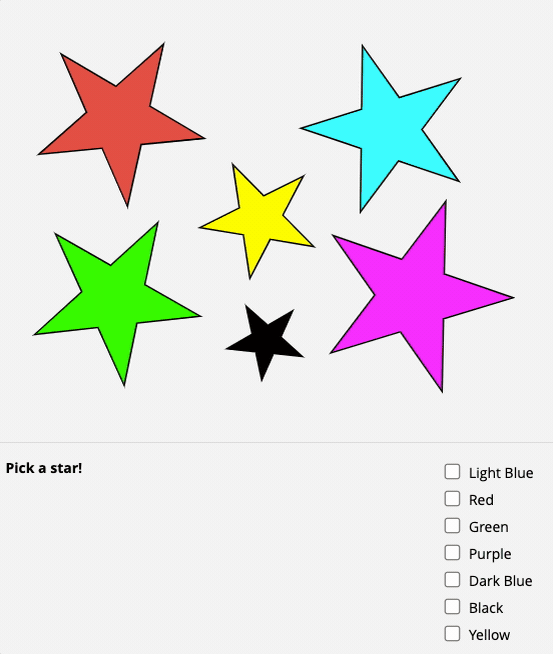

# SVG Imagemap

This module embeds an SVG file into a REDCap form/survey and linked to a checkbox field, so it can be used similarly to an HTML image map (but allows for much greater complexity).

## SVG File Requirements

The included `stars_example.svg` file may be helpful for understanding the structure required to properly use this module. A few key details to note:

* The opening `<svg>` tag must include the `xmlns:xlink="http://www.w3.org/1999/xlink"` attribute.
* Each element(s) intended to be clickable must wrapped in an `<a xlink:href="">` tag.
* Each `<a>` tag should also include a `data-rc-choice` attribute to define which REDCap field choice should be toggled when clicked.
* A `<style>` section containing CSS may optionally be defined to apply special styling when hovering over elements or to dynamically show/hide elements when selected.

Existing SVG files will likely need to be modified to work properly with this module. There are a number of free tools available online for creating your own SVG files (the included example was designed using https://editor.method.ac/ and customized to include the required `<a>` tags using a text editor).

## Configuration

This module should be enabled at the project-level and the following configuration values set:

* **SVG file to embed:** Please upload a valid `.svg` file here to be used as your image map.
* **Descriptive field to replace with SVG:** A descriptive field will be used as a "placeholder" for the SVG embed.
* **Checkbox field to link with SVG map:** A checkbox choice field will be kept in sync with the displayed image map. This field must be on the same instrument as the descriptive field, but it can be hidden using the `@HIDDEN` action tag.